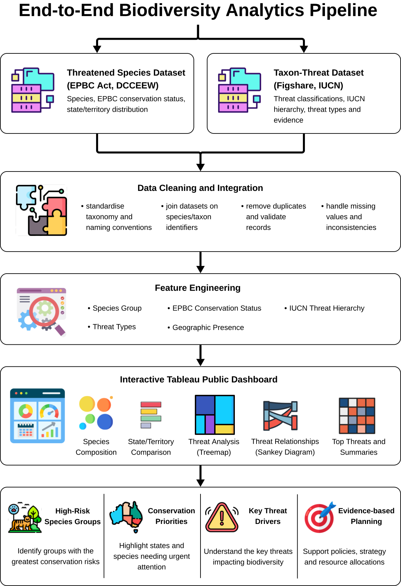

# Australian Biodiversity Analytics


An interactive Tableau dashboard that explores Australia's threatened species by integrating conservation status, biodiversity threats, and geographic distribution. The dashboard transforms multiple environmental datasets into an interactive analytical experience to support biodiversity research, conservation planning, and public awareness.

---

# Overview

Australia is one of the world's biodiversity hotspots, home to many species found nowhere else. However, habitat loss, invasive species, altered fire regimes, and climate change continue to threaten this unique natural heritage.

This project integrates official threatened species records with biodiversity threat classifications to provide an interactive analytical dashboard that enables users to explore conservation status, identify major drivers of biodiversity decline, and understand relationships between species groups, threats, and geographic distribution.

---

# Live Interactive Dashboard

Explore the complete interactive dashboard on Tableau Public:

**👉 https://public.tableau.com/views/DarrenChen-DataVisualisation1/Dashboard2?:language=en-GB&:display_count=n&:origin=viz_share_link**

---

# Dashboard Preview

<a href="https://public.tableau.com/views/DarrenChen-DataVisualisation1/Dashboard2?:language=en-GB&:display_count=n&:origin=viz_share_link">
  
</a>

**Figure 1.** Interactive Tableau dashboard exploring Australia's threatened species, conservation status, biodiversity threats, and relationships across species groups.

---

# Data Processing Pipeline

The dashboard follows an end-to-end analytical workflow that integrates multiple biodiversity datasets into a unified interactive visual analytics platform.



**Figure 2.** End-to-end analytics workflow illustrating how biodiversity datasets were integrated, transformed, and visualised to produce an interactive Tableau dashboard for exploring threatened species, conservation status, and the primary drivers of biodiversity decline.

---

# Business Problem

Australia maintains one of the world's richest ecosystems, yet thousands of native species continue to face increasing environmental pressures.

Conservation planning requires understanding not only which species are threatened, but also:

- which taxonomic groups are most vulnerable,
- where threatened species are geographically concentrated,
- which threats contribute most significantly to biodiversity decline,
- how threats differ across conservation status categories.

This dashboard supports evidence-based conservation planning by combining ecological datasets into a unified interactive analytical platform.

---

# Data Sources

The dashboard integrates two complementary public datasets.

| Dataset | Purpose |
|----------|----------|
| Threatened Species State Lists (DCCEEW) | Official EPBC conservation status and state/territory distribution |
| Taxon–Threat–Impact Dataset (Figshare) | IUCN threat classifications and biodiversity threat relationships |

These datasets provide both the conservation status of threatened species and the environmental factors contributing to biodiversity decline.

---

# Dashboard Features

The dashboard combines multiple coordinated visualisations to support exploratory analysis.

| Visualisation | Purpose |
|---------------|----------|
| Bubble Chart | Species composition across taxonomic groups |
| Highlight Table | Species distribution across EPBC conservation categories |
| Stacked Bar Chart | Conservation status comparison by Australian state and territory |
| Horizontal Bar Chart | Top biodiversity threats affecting Australian species |
| Hierarchical Treemap | Drill-down exploration of IUCN threat classifications |
| Sankey Diagram | Relationships between species groups, conservation status, and biodiversity threats |
| Summary Heatmap | Cross-comparison of species groups against major threat categories |

---

# Interactive Features

The dashboard supports several coordinated interactive behaviours.

- Cross-filtering between visualisations
- Dynamic highlighting across dashboard components
- Interactive tooltips with contextual ecological information
- Hierarchical exploration of biodiversity threats
- Comparative analysis across Australian states and territories
- Storytelling annotations highlighting key conservation findings

---

# Key Insights

The analysis highlights several important biodiversity patterns.

- Plants represent the largest proportion of Australia's threatened species.
- Invasive species remain one of the most significant drivers of biodiversity decline.
- Conservation priorities differ considerably across Australian states and territories.
- Certain threat categories consistently affect multiple taxonomic groups.
- Interactive exploration reveals complex relationships between conservation status and environmental threats.

---

# Technologies

- Tableau Desktop
- Tableau Public
- Data Visualisation
- Exploratory Data Analysis (EDA)

---

# Project Structure

```text
australian-biodiversity-analytics/
│
├── data/
│   ├── raw/
│   └── README.md
│
├── docs/
│   └── dashboard_story.pdf
│
├── images/
│   ├── dashboard_preview.png
│   └── tableau_data_pipeline.svg
│
├── tableau/
│   └── biodiversity_dashboard.twbx
│
├── LICENSE
├── README.md
└── .gitignore
```

---

# Skills Demonstrated

- Interactive Dashboard Design
- Tableau Desktop
- Tableau Public
- Data Storytelling
- Exploratory Data Analysis
- Environmental Data Analytics
- Data Integration
- Dashboard User Experience (UX)
- Information Visualisation
- Business Intelligence

---

# Future Improvements

Potential extensions include:

- Integrating live biodiversity data through public APIs.
- Supporting temporal analysis of conservation trends.
- Adding predictive modelling for biodiversity risk assessment.
- Incorporating additional ecological and climate indicators.
- Expanding geographic analysis beyond Australia.

---

# Acknowledgements

This project was developed using publicly available biodiversity datasets provided by:

- Australian Government Department of Climate Change, Energy, the Environment and Water (DCCEEW)
- Figshare Taxon–Threat–Impact Dataset

---

# License

This project is licensed under the MIT License.

See the `LICENSE` file for details.